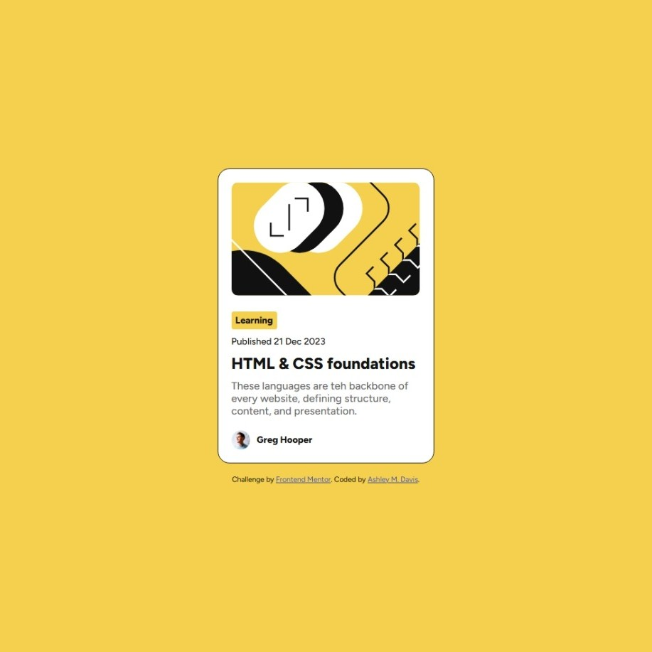
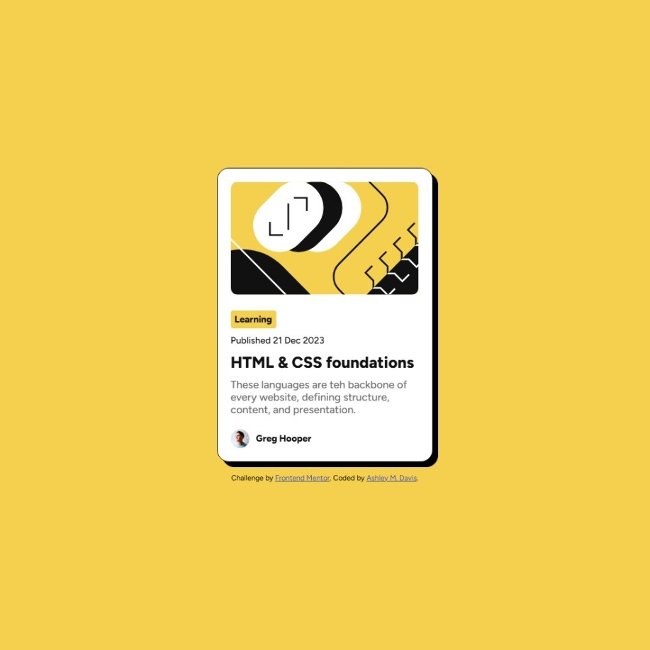

# Frontend Mentor - Blog preview card solution

This is a solution to the [Blog preview card challenge on Frontend Mentor](https://www.frontendmentor.io/challenges/blog-preview-card-ckPaj01IcS). Frontend Mentor challenges help you improve your coding skills by building realistic projects. 

## Table of contents

- [Overview](#overview)
  - [The challenge](#the-challenge)
  - [Screenshot](#screenshot)
  - [Links](#links)
- [My process](#my-process)
  - [Built with](#built-with)
- [Author](#author)

## Overview

### The challenge

Users should be able to:

- See hover and focus states for all interactive elements on the page

### Screenshot

#### Inactive Card

#### Active Card

### Links

- Solution URL: [Github]([https://your-solution-url.com](https://github.com/ashmdavis/Frontend-Mentor-Blog-Preview-Card-Solution/blob/main/index.html))
- Live Site URL: [Github Pages]([https://your-live-site-url.com](https://ashmdavis.github.io/Frontend-Mentor-Blog-Preview-Card-Solution/))

## My process

### Built with

- Semantic HTML5 markup
- CSS custom properties
- Flexbox

## Author

- Website - [Ashley M. Davis](https://ashleymdavis.net/)
- Frontend Mentor - [@ashmdavis]([https://www.frontendmentor.io/profile/yourusername](https://www.frontendmentor.io/profile/ashmdavis))
- Github - [@ashmdavis]([https://www.twitter.com/yourusername](https://github.com/ashmdavis))
